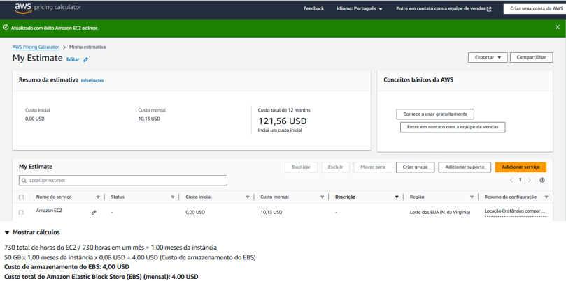
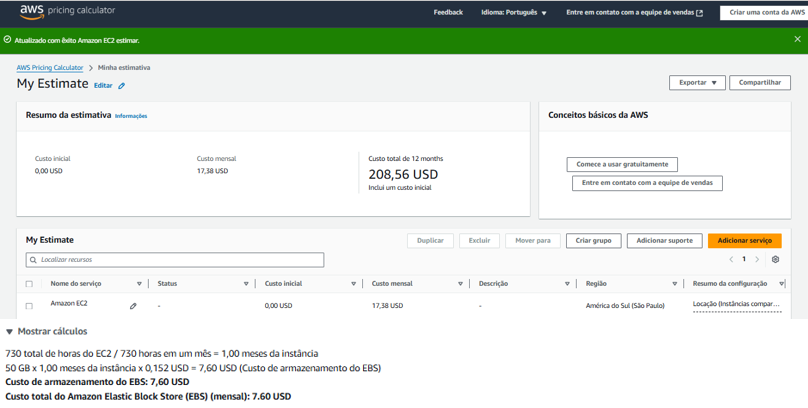

# FASE 5 - CAP 1 FarmTech Solutions — (IA • FIAP)

Este repositório contém as duas entregas obrigatórias:

- **Entrega 1 (Machine Learning)**: EDA, clusterização e 5 modelos de regressão para previsão de *Yield*.
- **Entrega 2 (Computação em Nuvem)**: estimativa de custos na AWS (On-Demand 100%) e justificativa de escolha de região.


#### 👥 Alunos
- Nome: Felipe Balthazar de Almeida #RM562434
- Nome: Fernando Gomes da Silva #RM561534
- Nome: Guilherme Urbinatti #RM565203
- Nome: Vinicius Burchert Vilas Boas #RM565395


## Entrega 1 - Machine Learning
▶️ [Demonstração no YouTube](https://youtu.be/iA28D0JxS0A) – Vídeo demonstrando o funcionamento do projeto

### 1.1 Como Usar
<a href="https://colab.research.google.com/github/TeamFiapAI/FASE-5---CAP-1-FARM-TECH/blob/main/ViniciusBurchertVilasBoas_RM565395_pbl_fase5.ipynb" target="_parent"></a>

OU
```
1. Crie um ambiente Python 3.10+ e instale as dependências:
   bash
   > pip install -r requirements.txt
   
2. Abra o notebook e execute tudo.
3. Os artefatos são gerados automaticamente durante a execução (métricas, modelo salvo e figuras).
```
```
# Criar ambiente
python -m venv venv

# Ativar
# Windows
venv\Scripts\activate
# Linux/Mac
source venv/bin/activate

# Instalar dependências
pip install --upgrade pip
pip install -r requirements.txt

Executar
jupyter lab
http://localhost:8888/lab/tree/ViniciusBurchertVilasBoas_RM565395_pbl_fase5.ipynb
```


### 1.2 Resumo técnico
> **Dados**: `crop_yield.csv` (colunas: Crop, Precipitation (mm day-1), Specific Humidity at 2 Meters (g/kg), Relative Humidity at 2 Meters (%), Temperature at 2 Meters (C), Yield).
> **Nome do arquivo**: ViniciusBurchertVilasBoas_RM565395_pbl_fase4.ipynb

- **EDA**: checagem de faltantes, duplicatas, distribuição; correlação e gráficos (matplotlib).  
- **Outliers**: detecção via **IQR** por variável.  
- **Tendências**: **KMeans** (k otimizado por **silhouette** em 2..8) sobre condições de clima/solo, analisando o **Yield** por cluster.  
- **Modelagem (5 regressões)**: `LinearRegression`, `Ridge`, `Lasso`, `RandomForestRegressor`, `GradientBoostingRegressor`, com **Pipeline + ColumnTransformer** (numéricos com `StandardScaler`, categóricos com `OneHotEncoder`) e **CV (KFold=5)**.  
- **Seleção**: melhor RMSE em CV; avaliação final em holdout.  
- **Export**: pipeline vencedor salvo como `modelo_melhor.pkl`; métricas agregadas em CSV.


## Entrega 2 - Computação em Nuvem
▶️ [Demonstração no YouTube](https://youtu.be/9nFQvahHRi8) – Vídeo demonstrando o funcionamento do projeto

### 2.1 Estimativa de custos (AWS On-Demand 100%)

**Especificação**: 2 vCPU, 1 GiB RAM, até 5 Gbps, 50 GB EBS (gp3), Linux.  
**Instâncias candidatas**: `t3.micro` (x86) ou `t4g.micro` (ARM).

#### Comparação de custos (definitivo)

| Região                              | Compute (USD/mês) | EBS 50 GB (USD/mês) | **Total (USD/mês)** |
|------------------------------------|------------------:|--------------------:|--------------------:|
| US East (N. Virginia) — **us-east-1**  | **6,13**          | **4,00**            | **10,13**           |
| South America (São Paulo) — **sa-east-1** | **9,78**          | **7,60**            | **17,38**           |

> Observação: `t4g.micro` (Graviton/ARM) costuma ter **menor custo** que `t3.micro` em várias regiões. Caso a aplicação exija x86, use `t3.micro` (mesma configuração de vCPU/RAM).

#### Resultado resumido (valores editáveis)
| Região | Compute (USD/h) | EBS gp3 (USD/GB-mês) | Horas/mês | Armazenamento | **Custo Mensal Estimado (USD)** |
|---|---:|---:|---:|---:|---:|
| US East (N. Virginia) — us-east-1 | **0,0084** | **0,08** | 730 | 50 GB | **10,13** |
| South America (São Paulo) — sa-east-1 | **0,0134** | **0,152** | 730 | 50 GB | **17,38** |

**Como reproduzir na Calculadora AWS**:
1. Acesse <https://calculator.aws/>.  
2. Adicione **Amazon EC2** ⇒ Linux, **t3.micro** (ou **t4g.micro**), **On‑Demand**, **Instâncias compartilhadas**.  
3. **Region**: compare **us-east-1** vs **sa-east-1**.  
4. Em **Storage** adicione **EBS gp3** com **50 GB** (sem IOPS/throughput adicionais).  
5. Considere ~**730 horas/mês**.

**Referências de preço (derivadas dos seus prints)** — confirme na calculadora:  
- EC2 t4g.micro: **us‑east‑1 ≈ 0,0084 USD/h**; **sa‑east‑1 ≈ 0,0134 USD/h**.  
- EBS gp3: **us‑east‑1 ≈ 0,08 USD/GB‑mês**; **sa‑east‑1 ≈ 0,152 USD/GB‑mês**.

#### Escolha de região
- Com **restrição legal de dados no Brasil** **e/ou** **baixa latência** para sensores locais ⇒ **sa‑east‑1**.  
- Sem restrição e buscando **menor custo** ⇒ **us‑east‑1**.  
- Se a aplicação suportar ARM, priorize **t4g.micro** (melhor preço/desempenho).

#### Screenshots
Inclua as capturas da calculadora no diretório `docs/` (os nomes abaixo são usados pelo README):
- 
- 

### 🏁 Conclusão
**Para a configuração proposta (2 vCPU, 1 GiB, 50 GB gp3, Linux, On‑Demand 100%) a região mais barata é **US East (N. Virginia — us‑east‑1)**, com custo aproximado de **US$ 10,13/mês** (~US$ 6,13 compute + US$ 4,00 EBS). Já **South America (São Paulo — sa‑east‑1)** fica por volta de **US$ 17,38/mês** (~US$ 9,78 compute + US$ 7,60 EBS). Se houver **restrição legal** para manter dados no Brasil **ou** necessidade de **latência menor** para ingestão dos sensores, escolha **sa‑east‑1**, mesmo com custo superior.

---

## 📂 Estrutura sugerida do repositório
```
.
├── ViniciusBurchertVilasBoas_RM565395_pbl_fase4.ipynb
├── requirements.txt
├── crop_yield.csv
├── modelo_melhor.pkl           # gerado pelo notebook
├── metrics_cv.csv              # gerado pelo notebook
├── aws_costs.csv               # comparativo de custos (opcional)
├── IA/                         # (se utilizados no notebook)
│   ├── perfil_clusters.csv
│   └── figuras/rmse_por_modelo.png
└── docs/
    ├── aws-us-east.png
    └── aws-sa-east.png
```
